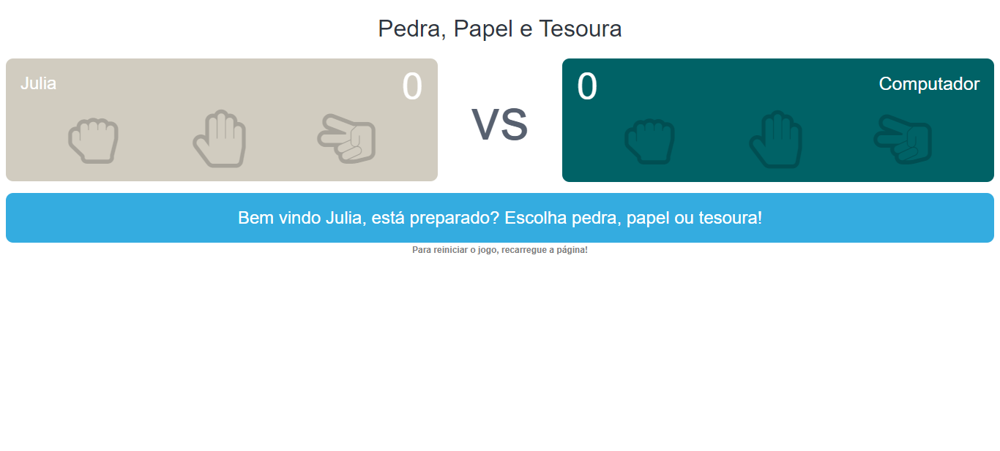

# Programar do Zero | Dev Samurai

> Professor: Felipe Fontoura

Projeto realizado em acompanhamento das aulas do curso Programar do Zero da comunidade Dev Samurai de Felipe Fontoura.

🔗 Clique [aqui](https://juliaparnahyba.github.io/jokenpo/) para acessar e se divertir um pouco!

## 🛠️ Tecnologias

- HTML
- CSS
- JavaScript

## 😎 Contato

prog.jump@gmail.com

[Meu Linkedin](https://www.linkedin.com/in/juliaparnahyba/)
